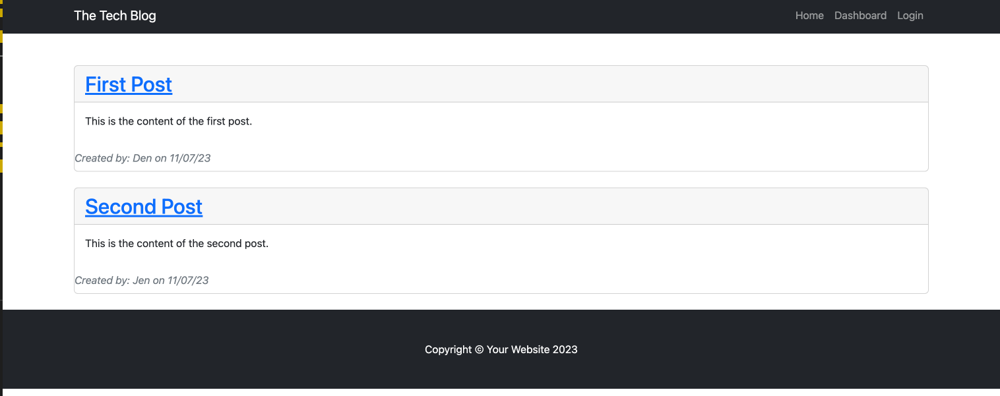
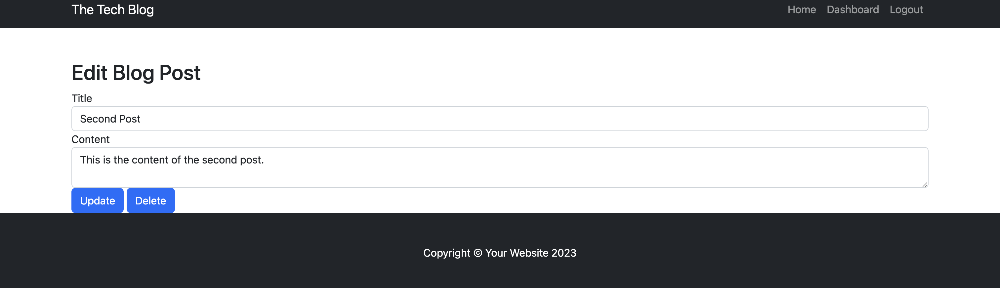
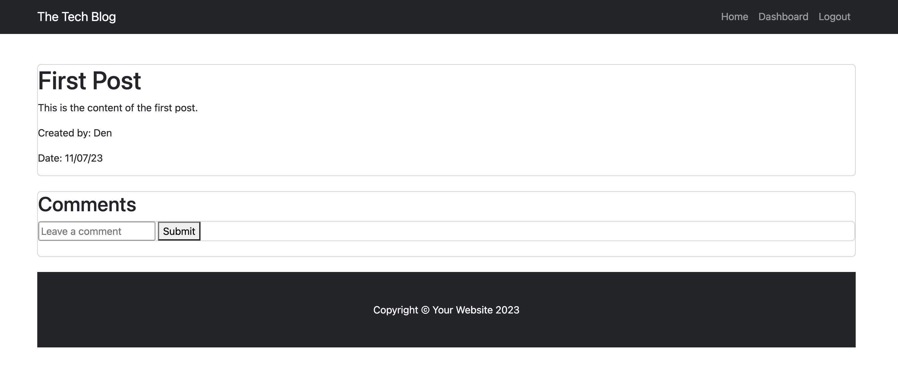

# Tech Blog

## Description

Tech Blog is a full stack application that allows developers to publish their blog posts and comment on other developers’ posts as well. Please visit the application [here](https://maya-tech-blog-8a50da98b642.herokuapp.com/).

## Table of Contents
- [Installation](#installation)
- [Usage](#usage)
- [Credit](#credit)
- [License](#license)
- [Author](#authors)

## Installation
To run the Project Inventory application locally, follow these steps:

1. Clone the repository to your local.
2. Install the dependencies: `npm install`
3. Set environment variables: Rename the `.env.EXAMPLE` file into `.env` and fill in the DB_USER and DB_PASSWORD with your database credentials and save the file.
4. Set up the database: 

    * Navigate to db directory and open the mySql shell and execute the schema.sql by running `source schema.sql` to create database.
    * Navigate to root directory and run `npm run seed` to seed data to your database.

5. Start the server: `npm start`

## Usage 
Once the application is up and running, follow these steps to use Project Inventory:

1. Access the application through your web browser.
2. You will be able to see the homepage and the blog post (if any).

3. To be able to see the post, you will be prompted to login or create an account.
4. Once logged in, you will be directed to dashboard page that contain your post.
5. Click on the post to update or delete it.

6. Click `Add New Blog Post` create a new post.
7. Click on one of the post in the homepage to add the comment.
8. Enter the comment in the box and click submit.

9. Log out when finished.

## Credit
- [Bootstrap](https://startbootstrap.com/template/blog-home)

## License
Please refer to the LICENSE in the repo.
